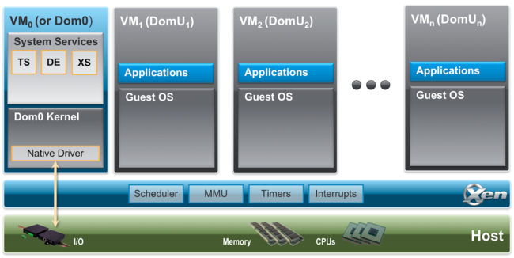

{ width="800" height="600" style="display: block; margin: 0 auto" }

# Homelab - Xen Project Hypervisor
This Homelab is setup on AMD epic server using Xen Project Hypervisor.

The Xen Project hypervisor is an open-source type-1 or baremetal hypervisor, which makes it possible to run many instances of an operating system or indeed different operating systems in parallel on a single machine (or host).

- [Xen Project](https://xenproject.org "Xen Project")

- [Xen Project Hypervisor](https://xenproject.org/projects/hypervisor "Xen Project Hypervisor")

- [wiki.xenproject.org](https://wiki.xenproject.org/wiki/Main_Page "wiki.xenproject.org")

